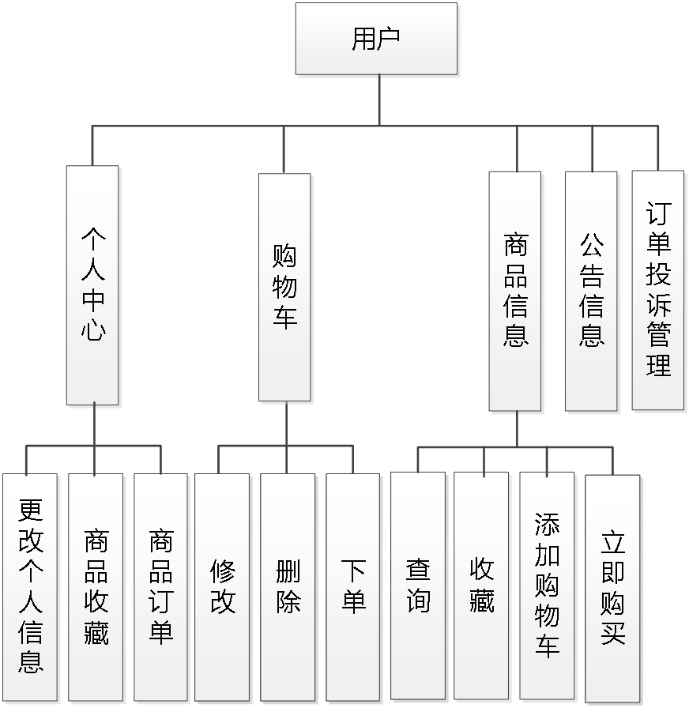
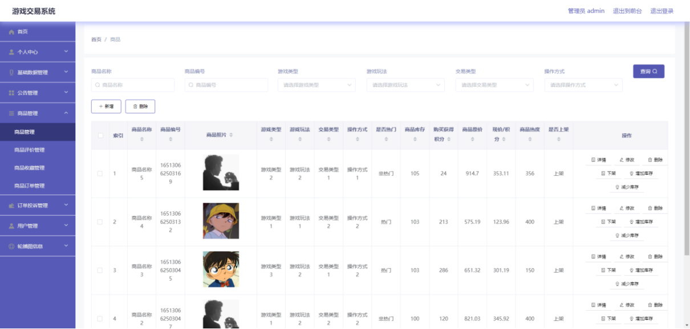
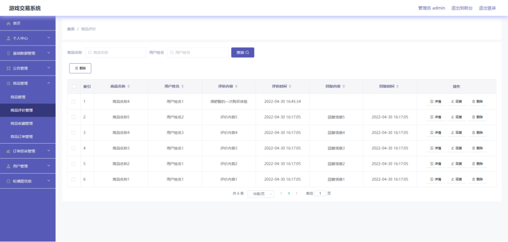
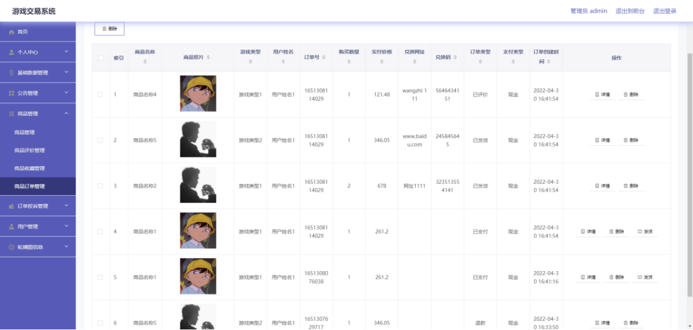
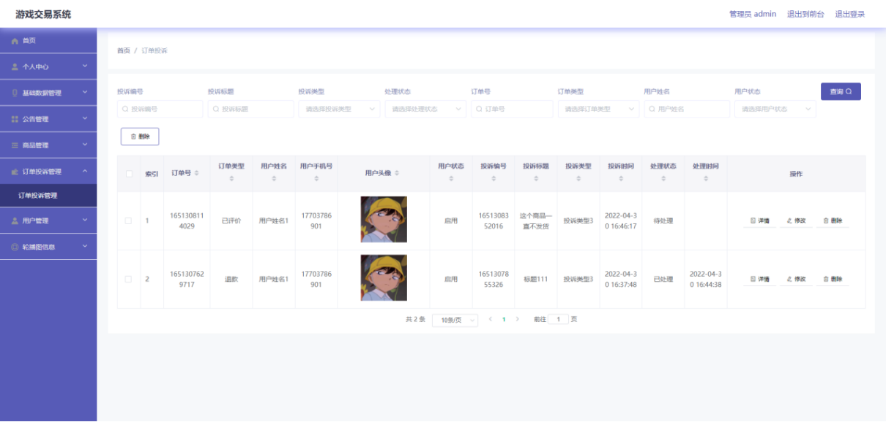
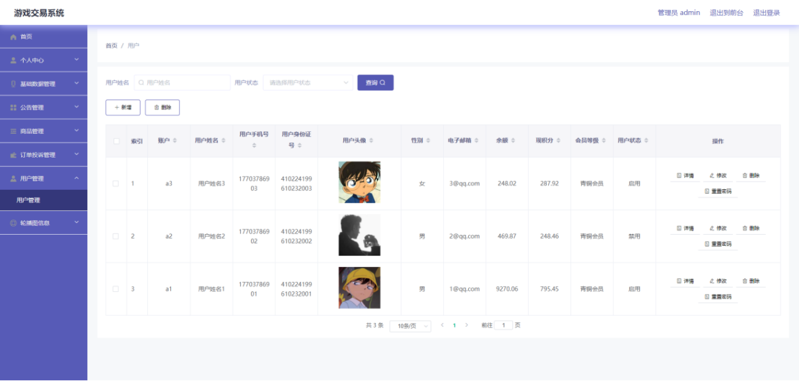
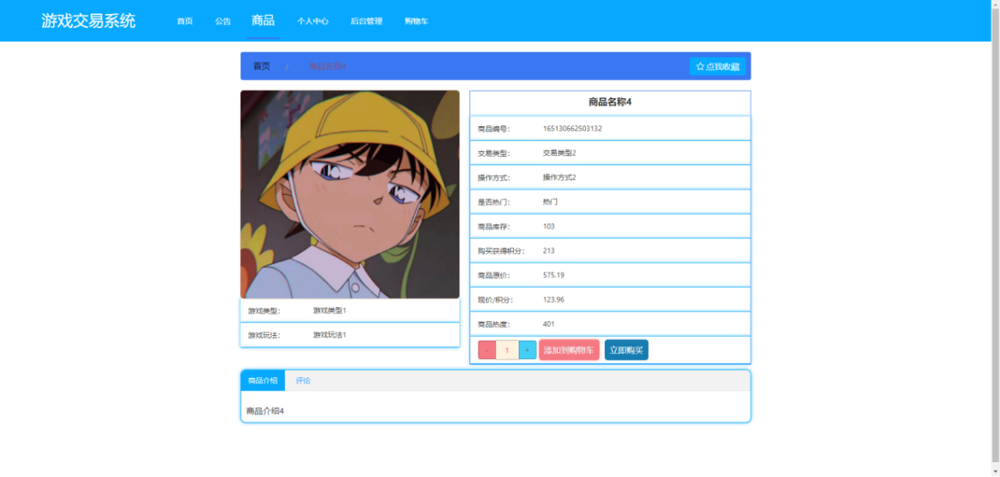
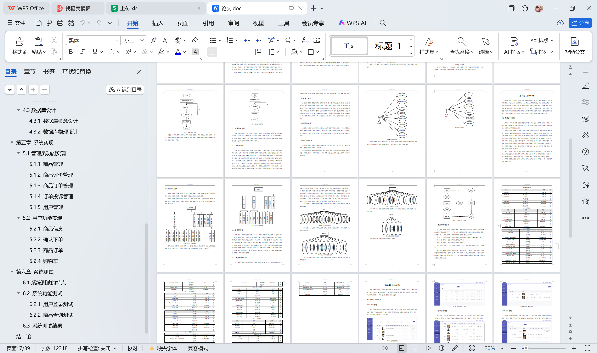

# springboot156-基于SpringBoot的游戏交易系统

>  博主介绍：
>  Hey，我是程序员Chaers，一个专注于计算机领域的程序员
>  十年大厂程序员全栈开发‍ 日常分享项目经验 解决技术难题与技术推荐 承接各类网站设计，小程序开发，毕设等。
>  【计算机专业课程设计，毕业设计项目，Java，微信小程序，安卓APP都可以做，不仅仅是计算机专业，其它专业都可以】

## 本项目获取地址：https://www.bishecode.com/product/153/

## 3000套系统可挑选，获取链接：https://www.bishecode.com/

### 系统架构

> 前端：html | js | css | jquery | vue
>
> 后端：springboot | mybatis
> 
> 环境：jdk1.8+ | mysql | maven

# 一、内容包括
包括有  项目源码+项目论文+数据库源码+答辩ppt+远程调试成功

# 二、运行环境

> jdk版本：1.8 及以上； ide工具：IDEA； 数据库: mysql5.7及以上；编程语言: Java

# 三、需求分析

**3.1可行性分析**

在项目进行开发之前，必须要有可行性分析报告，分别从技术角度，经济角度，操作角度上面进行分析，经过可行性分析是实现科学开发的必要步骤。

**3.1.1技术可行性**

从技术的角度出发，目前采用开发的技术完全能满足系统开发需要。目前市场上有现成的软件开发工具和开发技术，这些可以保证系统开发的顺利进展。

**3.1.2操作可行性**

游戏交易系统是根据用户经常使用的页面操作流程来进行设计的，并且页面保证统一，从视觉角度和操作角度上都能达到使用要求。

**3.1.3经济可行性**

在本次开发过程中，因为需要通过电脑来进行配置开发的环境，通过对技术的分析，发现目前正在使用的电脑是可以满足开发需要的，并不需要太多的金钱对电脑进行更换。所以，从经济角度上分析，可以满足开发要求。
从以上三个角度来进行分析论证，证明了游戏交易系统是可以正常开发并且使用的。

**3.2系统流程分析**

从系统的角色上分析，每个用户角色都代表了不同的账号身份，而不同的身份则代表着功能的异同，所以首先要区分用户的角色身份问题。设置用户登录需要输入账号和密码，输入的信息必须与数据库里已经存在的账号密码信息进行比对，只有正确的账号和密码才可以进行下一步的页面显示操作，如果不正确的账号密码，则拒绝用户登录，也代表着用户没有继续访问的权限，系统是无法继续提供服务的。

# 四、功能模块

本系统主要是基于数据的增加，修改，删除等操作，使用者能够通过提前设定的登录功能进入指定的操作区，这里对使用者设计的功能进行结构展示。
管理员功能结构图的绘制结果见图。管理员登录进入本系统操作的功能包括对商品信息，订单投诉信息，商品评价信息，商品收藏信息，会员等级信息，商品订单信息等进行管理。

用户功能结构图的绘制结果见图。用户登录进入本系统操作的功能包括收藏喜欢的商品以及购买商品，查看商品购买信息，管理购物车，管理订单投诉等。

# 五、效果图展示【部分效果图】

图5-1 商品管理界面【管理员进入如图5-1所示的商品管理界面之后，管理员点击信息显示栏中最右侧的修改，删除，下架，增加库存，减少库存按钮可依次完成商品信息的修改，删除，下架，商品库存增加，减少商品库存等操作】

图5-2 商品评价管理界面【管理员进入如图5-2所示的商品评价管理界面之后，管理员点击信息显示栏中最右侧的回复，删除按钮可依次完成商品评价信息的回复，删除等操作。】

图5-3 商品订单管理界面【管理员进入如图5-3所示的商品订单管理界面之后，管理员点击信息显示栏中最右侧的详情，删除，发货按钮可依次完成商品订单信息的详情查看，删除，发货等操作。】

图5-4 订单投诉管理界面【管理员进入如图5-4所示的订单投诉管理界面之后，管理员点击信息显示栏中最右侧的修改，删除按钮可依次完成订单投诉信息的修改，删除操作。】

图5-5 用户管理界面【管理员进入如图5-5所示的用户管理界面之后，管理员点击信息显示栏中最右侧的修改，删除，重置密码按钮可依次完成用户信息的修改，删除，账户密码重置等操作。】

图5-6 商品信息界面【用户进入如图5-6所示的商品信息界面之后，用户通过商品介绍信息了解商品，用户点击立即购买按钮可以实现商品的快速下单。】

 <b>完整文章</b>
 
 
 

## 本项目获取地址：https://www.bishecode.com/product/153/

## 3000套系统可挑选，获取链接：https://www.bishecode.com/

